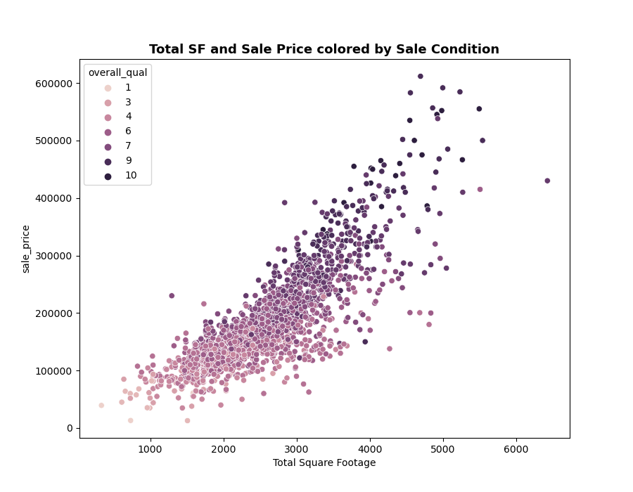
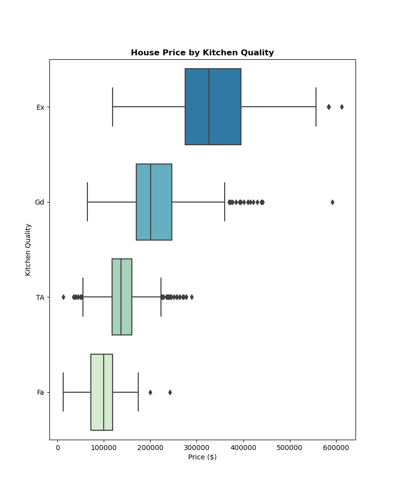
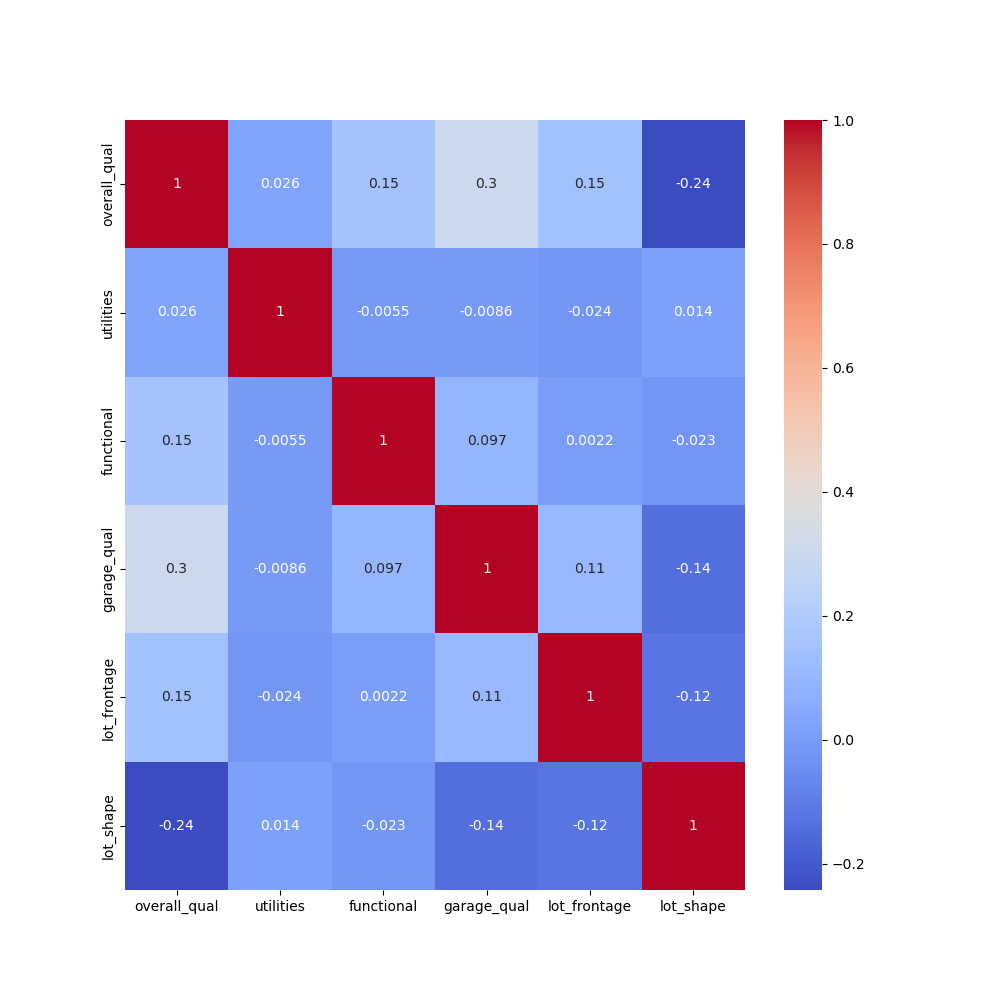

# Ames Housing Data 

## Table of Contents

- [Problem Statement](#Problem-Statment)
- [Description of Data](#Description-of-Data)
- [Methodology](#Methodology)
- [Conclusions and Recommendations](#Conclusions-and-Recommendations)
- [Sources](#Sources)

---

## Problem Statement

This project aims to create an effective, predictive linear regression model based on the Ames Housing Data organized by Dean De Cock.

The predictive model will be constructed to accurately predict a residential property's sales price based on key features. Homeowners and real estate firms across the world interested in selling their properties need to have an accurate method of determining their market value. The primary metrics used to evaluate this model are the R² score and the Root Mean Squared Error. A successful model will provide a training and testing R² score above .9 and a training and testing RMSE below $20,000. Yielding a successful model with the Ames Data ultimately opens possibilites to develop similar predictive models in any neighborhood.

### Background Research

Determining the sale price of a house is often complicated due to the sheer number of variables that influence pricing decisions. Most of these variables can be perceived as subjective and can range from factors like number of bedrooms to basement height. This is one of the main problems for realtors, homeowners, and individuals looking to sell that want to rank the most important factors affecting sale price. 

As previously mentioned, a wealth of factors can shape a property's value and sales price. Size, age, and condition are all important aspects. 1Additionally, one should consider features of the home and the local neighborhood.2 Historical prices may also impact a current home's perceived value.3  Lastly, external factors such as macroenconmic tendencies, the state of the housing market, and interest rates are also influential.4 

---

## Description of Data

### Data Sets

* [`train.csv`](./datasets/train.csv): Data set contains 2015 observations and 81 variables of residential properties sold in Ames, IA from 2006 to 2010.
* [`test.csv`](./datasets/test.csv): Data set contains 878 observations and 80 variables of residential properties sold in Ames, IA from 2006 to 2010. Test data has no "SalePrice" variable.
* [`AmesHousing.txt`](./AmesHousing.txt): Assessed values for individual residential properties sold in Ames, IA from 2006 to 2010.

### Data Dictionary

|Feature|Type|Dataset|Description|
|---|---|---|---|
|**id**|*integer*|train_clean.csv, test_clean.csv|Observation number| 
|**ms_subclass**|*object*|train_clean.csv, test_clean.csv|Identifies the type of dwelling involved in the sale| 
|**ms_zoning**|*object*|train_clean.csv, test_clean.csv|Identifies the general zoning classification of the sale|
|**lot_frontage**|*float*|train_clean.csv, test_clean.csv|Linear feet of street connected to property|
|**lot_area**|*integer*|train_clean.csv, test_clean.csv|Lot size in square feet|
|**street**|*object*|train_clean.csv, test_clean.csv|Type of road access to property|
|**alley**|*object*|train_clean.csv, test_clean.csv|Type of alley access to property|
|**lot_shape**|*object*|train_clean.csv, test_clean.csv|General shape of property|
|**land_contour**|*object*|train_clean.csv, test_clean.csv|Flatness of the property|
|**utilities**|*object*|train_clean.csv, test_clean.csv|Type of utilities available|
|**lot_config**|*object*|train_clean.csv, test_clean.csv|Lot configuration|
|**land_slope**|*object*|train_clean.csv, test_clean.csv|Slope of property|
|**neighborhood**|*object*|train_clean.csv, test_clean.csv|Physical locations within Ames city limits|
|**condition_1**|*object*|train_clean.csv, test_clean.csv|Proximity to various conditions|
|**condition_2**|*object*|train_clean.csv, test_clean.csv|Proximity to various conditions (if more than one is present)|
|**bldg_type**|*object*|train_clean.csv, test_clean.csv|Type of dwelling|
|**house_style**|*object*|train_clean.csv, test_clean.csv|Style of dwelling|
|**overall_qual**|*integer*|train_clean.csv, test_clean.csv|Rates the overall material and finish of the house|
|**overall_cond**|*integer*|train_clean.csv, test_clean.csv|Rates the overall condition of the house|
|**year_built**|*integer*|train_clean.csv, test_clean.csv|Original construction date|
|**year_remod/add**|*integer*|train_clean.csv, test_clean.csv|Remodel date (same as construction date if no remodeling or additions)|
|**roof_style**|*object*|train_clean.csv, test_clean.csv|Type of roof|
|**roof_matl**|*object*|train_clean.csv, test_clean.csv|Roof Material|
|**exterior_1st**|*object*|train_clean.csv, test_clean.csv|Exterior covering on house|
|**exterior_2nd**|*object*|train_clean.csv, test_clean.csv|Exterior covering on house (if more than one material)|
|**mas_vnr_type**|*object*|train_clean.csv, test_clean.csv|Masonry veneer type|
|**mas_vnr_area**|*float*|train_clean.csv, test_clean.csv|Masonry veneer area in square feet|
|**exter_qual**|*object*|train_clean.csv, test_clean.csv|Evaluates the quality of the material on the exterior |
|**exter_cond**|*object*|train_clean.csv, test_clean.csv|Evaluates the present condition of the material on the exterior|
|**foundation**|*object*|train_clean.csv, test_clean.csv|Type of foundation|
|**bsmt_qual**|*object*|train_clean.csv, test_clean.csv|Evaluates the height of the basement|
|**bsmt_cond**|*object*|train_clean.csv, test_clean.csv|Evaluates the general condition of the basement|
|**bsmt_exposure**|*object*|train_clean.csv, test_clean.csv|Refers to walkout or garden level walls|
|**bsmtfin_type_1**|*object*|train_clean.csv, test_clean.csv|Rating of basement finished area|
|**bsmt_sf_1**|*integer*|train_clean.csv, test_clean.csv|Type 1 finished square feet|
|**bsmtfin_type_2**|*object*|train_clean.csv, test_clean.csv|Rating of basement finished area (if multiple types)|
|**bsmtfin_sf_2**|*integer*|train_clean.csv, test_clean.csv|Type 2 finished square feet|
|**bsmt_unf_sf**|*integer*|train_clean.csv, test_clean.csv|Unfinished square feet of basement area|
|**total_bsmt_sf**|*integer*|train_clean.csv, test_clean.csv|Total square feet of basement area|
|**heating**|*object*|train_clean.csv, test_clean.csv|Type of heating|
|**heatingqc**|*object*|train_clean.csv, test_clean.csv|Heating quality and condition|
|**central_air**|*object*|train_clean.csv, test_clean.csv|Central air conditioning|
|**electrical**|*object*|train_clean.csv, test_clean.csv|Electrical system|
|**1st_flr_sf**|*integer*|train_clean.csv, test_clean.csv|First Floor square feet|
|**2nd_flr_sf**|*integer*|train_clean.csv, test_clean.csv|Second floor square feet|
|**low_qual_fin_sf**|*integer*|train_clean.csv, test_clean.csv|Low quality finished square feet (all floors)|
|**gr_liv_area**|*integer*|train_clean.csv, test_clean.csv|Above grade (ground) living area square feet|
|**bsmt_full_bath**|*integer*|train_clean.csv, test_clean.csv| Basement full bathrooms|
|**bsmt_half_bath**|*integer*|train_clean.csv, test_clean.csv| Basement half bathrooms|
|**full_bath**|*integer*|train_clean.csv, test_clean.csv|Full bathrooms above grade|
|**half_bath**|*integer*|train_clean.csv, test_clean.csv|Half baths above grade|
|**bedroom**|*integer*|train_clean.csv, test_clean.csv| Bedrooms above grade (does NOT include basement bedrooms)|
|**kitchen**|*integer*|train_clean.csv, test_clean.csv|Kitchens above grade|
|**kitchen_qual**|*object*|train_clean.csv, test_clean.csv|Kitchen quality|
|**totrms_abvgrd**|*integer*|train_clean.csv, test_clean.csv|Total rooms above grade (does not include bathrooms)|
|**functional**|*object*|train_clean.csv, test_clean.csv|Home functionality (Assume typical unless deductions are warranted)|
|**fireplaces**|*integer*|train_clean.csv, test_clean.csv|Number of fireplaces|
|**fireplace_qu**|*object*|train_clean.csv, test_clean.csv|Fireplace quality|
|**garage_type**|*object*|train_clean.csv, test_clean.csv|Garage location|
|**garage_yr_blt**|*integer*|train_clean.csv, test_clean.csv|Year garage was built|
|**garage_finish**|*object*|train_clean.csv, test_clean.csv|Interior finish of the garage|
|**garage_cars**|*integer*|train_clean.csv, test_clean.csv|Size of garage in car capacity|
|**garage_area**|*integer*|train_clean.csv, test_clean.csv|Size of garage in square feet|
|**garage_qual**|*integer*|train_clean.csv, test_clean.csv|Garage quality|
|**garage_cond**|*object*|train_clean.csv, test_clean.csv|Garage condition|
|**paved_drive**|*object*|train_clean.csv, test_clean.csv|Paved drivewayy|
|**wood_deck_sf**|*integer*|train_clean.csv, test_clean.csv|Wood deck area in square feet|
|**open_porch_sf**|*integer*|train_clean.csv, test_clean.csv|Open porch area in square feet|
|**enclosed_porch**|*integer*|train_clean.csv, test_clean.csv|Enclosed porch area in square feet|
|**3-ssn_porch**|*integer*|train_clean.csv, test_clean.csv|Three season porch area in square feet|
|**screen_porch**|*integer*|train_clean.csv, test_clean.csv|Screen porch area in square feet|
|**pool_area**|*integer*|train_clean.csv, test_clean.csv|Pool area in square feet|
|**pool_qc**|*object*|train_clean.csv, test_clean.csv|Pool quality|
|**fence**|*object*|train_clean.csv, test_clean.csv|Fence quality|
|**misc_feature**|*object*|train_clean.csv, test_clean.csv|Miscellaneous feature not covered in other categories|
|**misc_val**|*integer*|train_clean.csv, test_clean.csv|Value of miscellaneous feature|
|**mo_sold**|*integer*|train_clean.csv, test_clean.csv|Month Sold (MM)|
|**yr_sold**|*integer*|train_clean.csv, test_clean.csv|Year Sold (YYYY)|
|**sale_type**|*object*|train_clean.csv, test_clean.csv|Type of sale|
|**sale_condition**|*object*|train_clean.csv, test_clean.csv| Condition of sale|
|**sale_price**|*integer*|train_clean.csv| Sale price|

---

## Methodology

* The chosen datasets were imported and cleaned.
* Exploratory data analysis was conducted to identify variables that could impact sale price the most.
* Visualizations depicting distribution, spread, and correlation were created with Matplotlib and Seaborn to reinforce exploratory data analysis findings and to discover potential strong relationships with sale price.

* Key features were engineered to boost model performance and all variables used were transformed and scaled appropriately.
* Throughh insights gained from EDA and trial & error, a collection of 37 distinct variables were chosen to be used in the regression models.

* Multiple Linear Regression, Ridge Regression, Lasso Regression, and ElasticNet Regression were performed with the chosen variables and several metrics were used to analyze individual performance.
* Kaggle submissions of several models were made throughout the process.
* Inferential model was created to contrast against the predictive model and to highlight the extent of how key factors may affect sale price.

* Final information was summarized into conclusions and recommendations.

---

## Conclusions and Recommendations

Model|Train R-Squared|Test R-Squared|Cross-val Score|Train RMSE|Test RMSE|
|---|---|---|---|---|---|
|**Linear Regression**|.92|.88|.90|20_771|21_626|
|**Ridge**|.92|.89|.90|21_238|20_656|
|**Lasso**|.91|.88|.90|20_096|21_501|
|**ElasticNet**|.92|.89|.90|21_139|20_532|

Overall, the predictive models didn't meet all of the standards outlined in the problem statement. Nevertheless, the consistent RMSE scores and R-squared values indicate that an effective regression model can be constructed with the given data. Based on these experiments, I would most likely continue production with the Ridge or ElasticNet model due to slightly superior performance on the test data. Changing the manner in which data was cleaned, adjusting encoding of categorical variables, and rethinking numerical feature engineering are just a few examples of how to improve the metrics. Unfortunately, the complexity of this model and its violation of MLR assumptions leave any interpretation of the impact of individual variables on sale price as a lost cause. Perhaps it is possible to restructure these models in order to create one that has decent predictive and inferential capabilities for not just this city but many others. Also, future exploration of these data sets with more advnaced machine learning models may prove to yield even greater performance.

---

## Sources

1: [5 Factors That Affect a Home’s Value](https://www.experian.com/blogs/ask-experian/factors-that-affect-home-value/) 
2: [What Factors Influence The Sale Price Of A Home](https://www.rochesterrealestateblog.com/what-factors-influence-the-sale-price-of-a-home/) 
3: [6 factors that influence a home's value](https://www.inman.com/2017/08/07/6-factors-that-influence-a-homes-value/) 
4: [8 critical factors that influence a home’s value](https://www.opendoor.com/articles/factors-that-influence-home-value) 
